<p align="center">
  
</p>

<h1 align="center">Git Statistics</h1>

<p align="center">
  <strong>Generate beautiful, customizable SVG statistics cards for your GitHub profile</strong>
</p>

<p align="center">
  <a href="#features">Features</a> •
  <a href="#themes">Themes</a> •
  <a href="#quick-start">Quick Start</a> •
  <a href="#configuration">Configuration</a> •
  <a href="#architecture">Architecture</a>
</p>

---

## Features

- **Multiple Statistics Cards** - Overview stats, language distribution, contribution streaks, streak battery, and language puzzle
- **25+ Built-in Themes** - From Dracula to Nord, Catppuccin to Tokyo Night
- **Extensible Theme System** - Add your own themes via YAML files
- **Animated SVGs** - Smooth fade-in and slide animations
- **Fully Configurable** - Control which stats to show, filter repositories, and more
- **Automated Updates** - GitHub Actions workflow updates stats every 12 hours
- **Accumulated Metrics** - Track views and clones beyond GitHub's 14-day limit

## Generated Cards

### Overview Statistics
Displays comprehensive GitHub statistics including contributions, repositories, stars, forks, and more.

<p align="center">
  
  
</p>

### Language Distribution
Shows your most used programming languages with an animated progress bar.

<p align="center">
  
  
</p>

### Contribution Streak
Tracks your current and longest contribution streaks.

<p align="center">
  
  
</p>

### Streak Battery
Visual battery indicator showing your streak progress with recent contribution history.

<p align="center">
  
  
</p>

### Language Puzzle
Treemap visualization of your programming languages - area proportional to usage percentage.

<p align="center">
  
  
</p>

## Themes

Choose from **25+ built-in themes** or create your own:

| Category | Themes |
|----------|--------|
| **GitHub** | `default`, `light`, `dark`, `github_dimmed` |
| **Popular** | `dracula`, `nord`, `gruvbox`, `gruvbox_light`, `one_dark`, `monokai`, `tokyo_night`, `solarized_dark`, `solarized_light` |
| **Catppuccin** | `catppuccin_latte`, `catppuccin_frappe`, `catppuccin_macchiato`, `catppuccin_mocha` |
| **Material** | `palenight`, `material_darker`, `material_ocean`, `ayu`, `ayu_light`, `ayu_mirage` |
| **Creative** | `synthwave`, `cyberpunk`, `ocean`, `forest`, `sunset`, `midnight`, `aurora`, `neon`, `retro`, `lavender`, `rose_pine`, `rose_pine_dawn` |

### Theme Previews

<details>
<summary><b>Dracula</b></summary>

</details>

<details>
<summary><b>Nord</b></summary>

</details>

<details>
<summary><b>Tokyo Night</b></summary>

</details>

<details>
<summary><b>Catppuccin Mocha</b></summary>

</details>

## Quick Start

### 1. Use This Template
Click the **"Use this template"** button to create your own copy.

### 2. Create a Personal Access Token
1. Go to **Settings** → **Developer settings** → **Personal access tokens** → **Tokens (classic)**
2. Generate a new token with scopes: `repo`, `read:user`, `read:org`
3. Copy the token

### 3. Add Repository Secret
1. In your repository: **Settings** → **Secrets and variables** → **Actions**
2. Create secret named `ACCESS_TOKEN` with your token

### 4. Configure (Optional)
Edit `config.yml` to customize themes, filters, and statistics.

### 5. Run the Workflow
Go to **Actions** → **Update Stats** → **Run workflow**

## Configuration

All configuration is centralized in `config.yml`:

### Theme Selection

```yaml
themes:
  enabled:
    - default
    - dark
    - dracula
    - nord
    # Use 'all' to generate all themes
```

### Repository Filters

```yaml
stats_generation:
  excluded_repos: "repo1,repo2"
  excluded_langs: "HTML,CSS"
  include_forked_repos: "false"
  exclude_private_repos: "false"
  exclude_archive_repos: "true"
```

### Statistics Visibility

```yaml
stats_generation:
  show_total_contributions: "true"
  show_repositories: "true"
  show_lines_changed: "true"
  show_stars: "true"
  show_pull_requests: "true"
  # ... more options
```

## Creating Custom Themes

Add a new `.yml` file in `src/themes/`:

```yaml
# src/themes/my_theme.yml
my_awesome_theme:
  suffix: "MyAwesome"
  colors:
    bg_color: "#1a1b26"
    title_color: "#7aa2f7"
    text_color: "#a9b1d6"
    icon_color: "#bb9af7"
    percent_color: "#565f89"
    border_color: "#292e42"
    accent_color: "#9ece6a"
    gradient_start: "#7aa2f7"
    gradient_end: "#bb9af7"
```

Then enable it in `config.yml`:

```yaml
themes:
  enabled:
    - my_awesome_theme
```

## Architecture

```
src/
├── core/                    # Business logic
│   ├── config.py           # Configuration management
│   ├── environment.py      # Environment variables
│   ├── github_client.py    # GitHub API client (GraphQL + REST)
│   ├── mock_stats.py       # Mock data for testing
│   └── stats_collector.py  # Statistics aggregation
├── db/                     # Data persistence
│   └── db.py               # JSON database for accumulated metrics
├── generators/             # SVG generators
│   ├── base.py             # Base generator class
│   ├── languages.py        # Language distribution card
│   ├── languages_puzzle.py # Language treemap card
│   ├── overview.py         # Overview statistics card
│   ├── streak.py           # Contribution streak card
│   └── streak_battery.py   # Streak battery card
├── presentation/           # Rendering layer
│   ├── stats_formatter.py  # Data formatting utilities
│   └── svg_template.py     # SVG template engine
├── templates/              # SVG templates
│   ├── overview.svg
│   ├── languages.svg
│   ├── languages_puzzle.svg
│   ├── streak.svg
│   └── streak_battery.svg
├── themes/                 # Theme definitions
│   ├── loader.py           # Theme loading utilities
│   ├── github.yml
│   ├── popular.yml
│   ├── catppuccin.yml
│   ├── material.yml
│   └── creative.yml
├── utils/                  # Utility functions
│   └── file_system.py      # File system helpers
└── orchestrator.py         # Main coordinator
```

### Key Design Decisions

- **Async/Await** - Concurrent API calls for better performance
- **Separation of Concerns** - Clear boundaries between data, logic, and presentation
- **YAML-based Themes** - Easy to add, remove, or modify themes
- **Template Engine** - Simple placeholder replacement for maintainability
- **Persistent Storage** - JSON database for accumulated metrics

## Development

### Prerequisites
- Python 3.10+
- pip

### Setup

```bash
pip install -r requirements.txt
```

### Running Locally

#### With GitHub API (real data)

```bash
export ACCESS_TOKEN="your_github_token"
export GITHUB_ACTOR="your_username"
python generate.py
```

#### With Mock Data (no API required)

For testing templates, themes, and visual changes without needing a GitHub token:

```bash
python generate_test.py
```

This generates all SVG cards using mock data in the `generated_images/` folder. Useful for:
- Testing theme modifications
- Developing new SVG templates
- Previewing visual changes locally
- CI/CD pipelines without API access

### Running Tests

```bash
pytest test/
```

## Contributing

Contributions are welcome! Feel free to:

- Add new themes
- Improve SVG templates
- Add new statistics
- Fix bugs
- Improve documentation

## License

GPL-3.0 License - see [LICENSE](LICENSE) for details.

---

<p align="center">
  <sub>Built with Python and GitHub Actions</sub>
</p>
