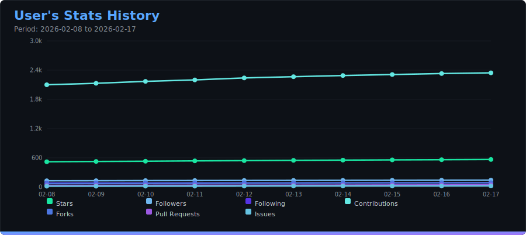
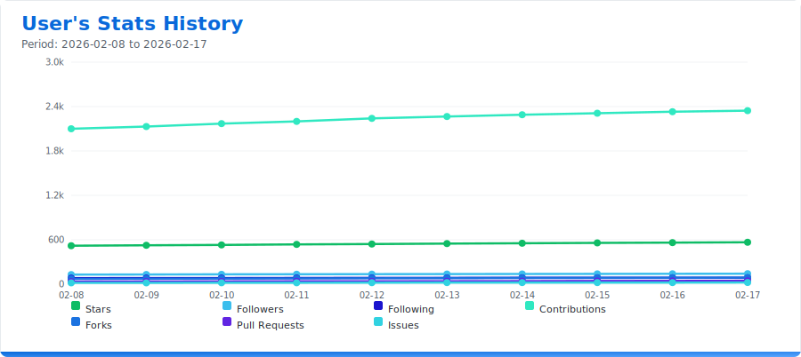
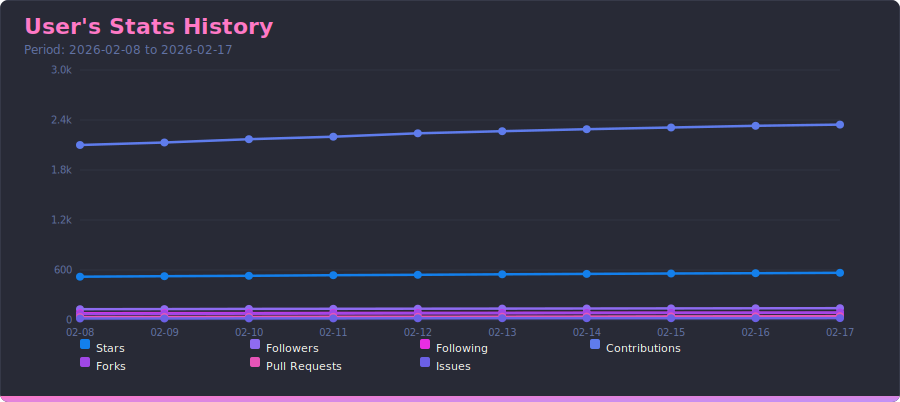
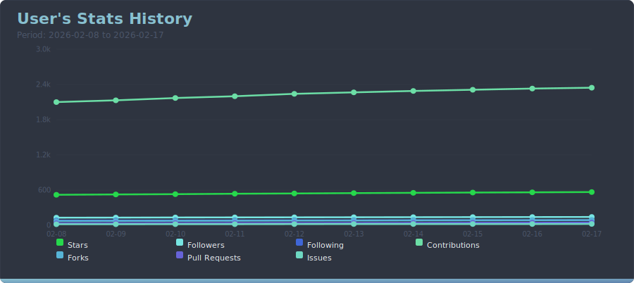
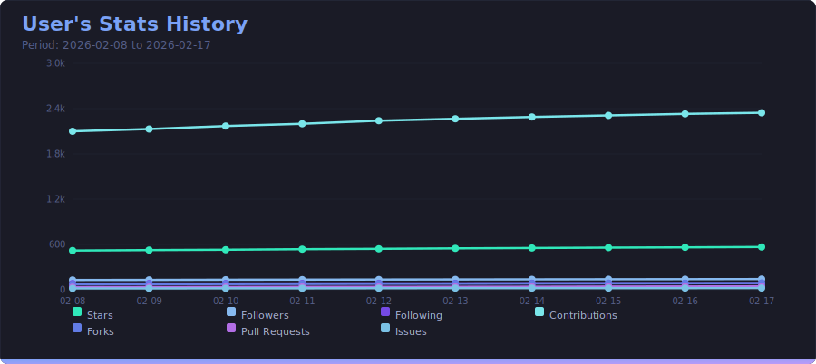
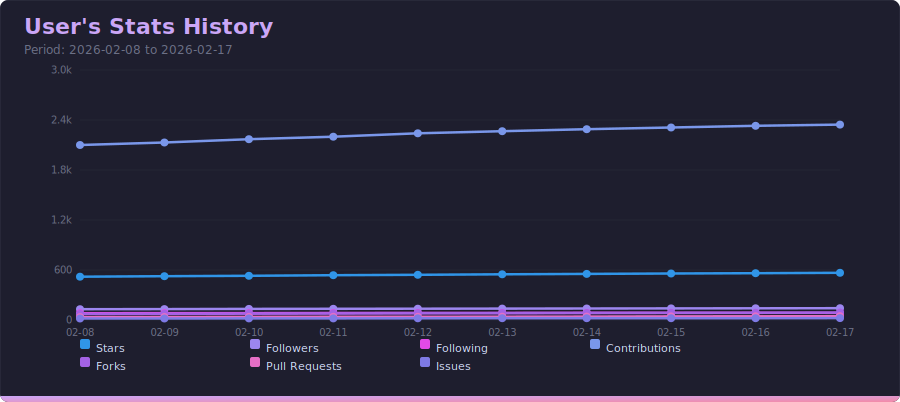

<p align="center">
  
</p>

<h1 align="center">Leo's Git Statistics</h1>

<p align="center">
  <strong>Generate beautiful, customizable SVG statistics cards for your GitHub profile</strong>
</p>

<p align="center">
  <a href="#features">Features</a> •
  <a href="#themes">Themes</a> •
  <a href="#quick-start">Quick Start</a> •
  <a href="#configuration">Configuration</a> •
  <a href="#architecture">Architecture</a>
</p>

---

## Entry Points

### CLI

| Entry point        | Description                        |
|--------------------|------------------------------------|
| `generate.py`      | Generates SVG cards from live data |
| `generate_test.py` | Generates SVG cards with mock data |

### API

| Entry point                  | Description                            |
|------------------------------|----------------------------------------|
| `api/`                       | Serves live stats + SVG cards via HTTP |
| `api/generate_static_api.py` | Generates JSON files + saves snapshot  |

### CI (Consumer Repository)

| Entry point | Description |
|---|---|
| Consumer workflow (for example: `.github/workflows/update-static-api-data.yml`) | Scheduled job in the consuming repository that generates/saves snapshots |

### When to Use Each Mode

| Mode | Use when | Data source | Config source |
|---|---|---|---|
| `generate.py` | You want SVGs directly from GitHub APIs | Live GitHub API | `config.yml` (if you cloned the repo) or Action `config-overrides` (if you use a workflow) |
| `generate.py` + `STATIC_API_DATA_DIR` | You want SVGs from pre-generated JSON (no live API calls during render). Requires a workflow in the consumer repository to generate/update `api-data` first. | `api-data/users/{username}/*.json` | `config.yml` (if you cloned the repo) or Action `config-overrides` (if you use a workflow) |
| `generate_test.py` | You want sample/mock SVG output for testing templates/themes | Mock data in code | `config.yml` |
| `api/` (FastAPI) | You want HTTP endpoints/cards for external consumers | Live GitHub API | `config.yml` (generation settings) + server env/runtime scope rules |
| `api/generate_static_api.py` | You want to publish static JSON for GitHub Pages/CDN | Live GitHub API at generation time | `config.yml` (default or `CONFIG_PATH`) + optional `CONFIG_OVERRIDES` (script/workflow env) |

For card/stat generation settings, `config.yml` is the single base source.  
Overrides are explicit:
- Action: `with: config-overrides`
- Static API script: `CONFIG_OVERRIDES`

These are two override channels for two different entry points:
- `with: config-overrides` is consumed by the reusable GitHub Action (`uses: leonardokr/leo-git-statistics@v2`).
- `CONFIG_OVERRIDES` is consumed by the static JSON generator script (`api/generate_static_api.py`).
- In both cases, `config.yml` remains the base configuration and overrides are merged at runtime.
- In mixed workflows (generate JSON first, then render SVGs), both channels can appear in the same workflow:
  script step uses `CONFIG_OVERRIDES`, action step uses `with: config-overrides`.

Workflow example for this mode: [Generate SVGs from Static JSON (offline render mode)](#generate-svgs-from-static-json-offline-render-mode)

### Snapshot Data Flow

A snapshot is a timestamped record of a user's GitHub statistics (stars, forks, followers, contributions, PRs, issues) saved to a SQLite database. Because GitHub does not provide historical data for most of these metrics, snapshots are the only way to track how they change over time. The stats history line chart is built entirely from these accumulated snapshots.

- **Writers:** `api/` (POST /history/snapshot), `api/generate_static_api.py`, consumer repository workflow (cron)
- **Readers:** `generate.py` (stats_history chart), `api/` (history endpoint + stats-history card)

## Features

- **Multiple Statistics Cards** - Overview stats, language distribution, contribution streaks, streak battery, language puzzle, weekly commit calendar, and stats history line chart
- **25+ Built-in Themes** - From Dracula to Nord, Catppuccin to Tokyo Night
- **Extensible Theme System** - Add your own themes via YAML files
- **Animated SVGs** - Smooth fade-in and slide animations
- **Fully Configurable** - Control which stats to show, filter repositories, and more
- **Reusable GitHub Action** - Run the generator from any repository (great for profile repos)
- **Historical Statistics Tracking** - Daily snapshots via GitHub Actions cron, with multi-series line chart visualization
- **Accumulated Metrics** - Track views and clones beyond GitHub's 14-day limit using SQLite with WAL mode
- **REST API** - FastAPI-based async API with JSON and SVG card endpoints, Swagger docs, caching (Redis or in-memory), rate limiting, API key auth, and Prometheus metrics
- **Production-Ready** - Docker/docker-compose deployment with gunicorn, Redis cache, structured logging, circuit breaker, and retry with exponential backoff

## Generated Cards

### Overview Statistics
Displays comprehensive GitHub statistics including contributions, repositories, stars, forks, and more.

<p align="center">
  
  
</p>

### Language Distribution
Shows your most used programming languages with an animated progress bar.

<p align="center">
  
  
</p>

### Contribution Streak
Tracks your current and longest contribution streaks.

<p align="center">
  
  
</p>

### Streak Battery
Visual battery indicator showing your streak progress with recent contribution history.

<p align="center">
  
  
</p>

### Language Puzzle
Treemap visualization of your programming languages - area proportional to usage percentage.

<p align="center">
  
  
</p>

### Weekly Commit Calendar
Agenda-style weekly calendar where each commit is a time block, with repositories separated by color.

<p align="center">
  
</p>
<p align="center">
  
</p>

### Stats History
Multi-series line chart showing how your stats (stars, followers, following, contributions, forks, PRs, issues) evolve over time. Requires historical snapshots collected via the daily cron workflow or `POST /history/snapshot`.

<p align="center">
  
</p>
<p align="center">
  
</p>

## Themes

Choose from **25+ built-in themes** or create your own:

| Category | Themes |
|----------|--------|
| **GitHub** | `default`, `light`, `dark`, `github_dimmed` |
| **Popular** | `dracula`, `nord`, `gruvbox`, `gruvbox_light`, `one_dark`, `monokai`, `tokyo_night`, `solarized_dark`, `solarized_light` |
| **Catppuccin** | `catppuccin_latte`, `catppuccin_frappe`, `catppuccin_macchiato`, `catppuccin_mocha` |
| **Material** | `palenight`, `material_darker`, `material_ocean`, `ayu`, `ayu_light`, `ayu_mirage` |
| **Creative** | `synthwave`, `cyberpunk`, `ocean`, `forest`, `sunset`, `midnight`, `aurora`, `neon`, `retro`, `lavender`, `rose_pine`, `rose_pine_dawn` |

### Theme Previews

<details>
<summary><b>Dracula</b></summary>
<div align="center">

</div>
<div align="center">




</div>
</details>

<details>
<summary><b>Nord</b></summary>
<div align="center">

</div>
<div align="center">



</div>
</details>

<details>
<summary><b>Tokyo Night</b></summary>
<div align="center">

</div>
<div align="center">



</div>
</details>

<details>
<summary><b>Catppuccin Mocha</b></summary>
<div align="center">

</div>
<div align="center">



</div>
</details>

## Quick Start

### 1. Choose Mode
Pick the mode that matches your goal in **When to Use Each Mode** above.
- For profile card generation, use the reusable action (`uses: leonardokr/leo-git-statistics@v2`).
- For static JSON + SVG render (no live API calls during render), use a consumer workflow with two steps: `api/generate_static_api.py` then the reusable action with [`static-api-data-dir`](#generate-svgs-from-static-json-offline-render-mode).
- For source-level customization, clone/template this repository.

### 2. Create a Personal Access Token
1. Go to **Settings** -> **Developer settings** -> **Personal access tokens** -> **Tokens (classic)**
2. Generate a new token with scopes: `repo`, `read:user`, `read:org`
3. Copy the token

### 3. Add Secret in Profile Repository
1. In your profile repository (`<username>/<username>`): **Settings** -> **Secrets and variables** -> **Actions**
2. Create secret named `PROFILE_STATS_TOKEN` with your token

### 4. Add Workflow (Action Mode)

```yaml
- name: Generate profile SVG stats
  uses: leonardokr/leo-git-statistics@v2
  with:
    github-token: ${{ secrets.PROFILE_STATS_TOKEN }}
    github-username: leonardokr
    output-dir: profile
```

### 5. Configure (Optional)
Use `config-path` and/or `config-overrides` in the workflow.

## Workflow Configuration (Profile Repository)

Use this repository as an Action in your profile repository. This is the recommended path for most users.

Required secret in your profile repository:

- `PROFILE_STATS_TOKEN`: token used by `generate.py` to query GitHub APIs.

### Example Workflow (profile repository)

```yaml
name: Update Profile SVG Stats

on:
  schedule:
    - cron: "0 */12 * * *"
  workflow_dispatch:

permissions:
  contents: write

jobs:
  build:
    runs-on: ubuntu-latest

    steps:
      - name: Checkout profile repository
        uses: actions/checkout@v4

      - name: Generate SVGs via leo-git-statistics action
        uses: leonardokr/leo-git-statistics@v2
        with:
          github-token: ${{ secrets.PROFILE_STATS_TOKEN }}
          github-username: leonardokr
          output-dir: profile
          config-path: config.yml
          config-overrides: |
            timezone: America/Sao_Paulo
            themes:
              enabled: [dark, light]
            stats_generation:
              exclude_contrib_repos: "true"
              mask_private_repos: "true"

      - name: Commit and push
        run: |
          git config user.name "github-actions[bot]"
          git config user.email "github-actions[bot]@users.noreply.github.com"
          git add profile/*.svg
          if ! git diff --quiet --staged; then
            git commit -m "chore(stats): update profile SVG stats"
            git push
          fi
```

### Generate SVGs from Static JSON (offline render mode)

If you already generated static files with `api/generate_static_api.py`, you can render cards without calling GitHub APIs during `generate.py` by passing `static-api-data-dir`.

```yaml
- name: Generate static API JSON files
  env:
    GITHUB_TOKEN: ${{ secrets.PROFILE_STATS_TOKEN }}
    GITHUB_ACTOR: ${{ github.repository_owner }}
    SNAPSHOTS_DB_PATH: ${{ github.workspace }}/api-data/snapshots.db
    CONFIG_OVERRIDES: |
      timezone: America/Sao_Paulo
      stats_generation:
        exclude_contrib_repos: "true"
        mask_private_repos: "true"
  run: python api/generate_static_api.py

- name: Generate SVGs from static JSON
  uses: leonardokr/leo-git-statistics@v2
  with:
    github-token: ${{ secrets.PROFILE_STATS_TOKEN }}
    github-username: leonardokr
    output-dir: profile
    config-path: config.yml
    static-api-data-dir: api-data
    config-overrides: |
      timezone: America/Sao_Paulo
      themes:
        enabled: [dark, light]
      stats_generation:
        mask_private_repos: "true"
```

Under the hood, this maps to env `STATIC_API_DATA_DIR` in the action runtime.
Keep static-generation and render overrides aligned to avoid mismatched behavior.
### Action Inputs (`with:`)

| Input                 | Required | Default            | Description                                                                  |
| -----------------------| ----------| --------------------| ------------------------------------------------------------------------------|
| `github-token`        | Yes      | -                  | GitHub token consumed as `ACCESS_TOKEN`.                                     |
| `github-username`     | No       | `github.actor`     | GitHub user to collect stats for.                                            |
| `python-version`      | No       | `3.11`             | Python runtime version.                                                      |
| `output-dir`          | No       | `generated_images` | Destination folder in caller repository.                                     |
| `config-path`         | No       | `config.yml`       | Path to the config file in caller repository.                                |
| `config-overrides`    | No       | -                  | YAML fragment merged into config at runtime.                                 |
| `static-api-data-dir` | No       | -                  | Static JSON root path (example: `api-data`) to enable `STATIC_API_DATA_DIR`. |

## Configuration via Action (No Clone)

If you use only `uses: leonardokr/leo-git-statistics@v2`, you can configure behavior with:
- `with: config-path` (read a config file from the caller repository, optional)
- `with: config-overrides` (inline YAML overrides)

If `config-path` does not exist in the caller repository, the action uses its bundled `config.yml` as base and then applies `config-overrides`.

### Supported `config-overrides` Keys

```yaml
timezone:
themes:
  enabled:

stats_generation:
  excluded_repos:
  excluded_langs:
  include_forked_repos:
  exclude_contrib_repos:
  exclude_archive_repos:
  exclude_private_repos:
  exclude_public_repos:
  mask_private_repos:
  store_repo_views:
  store_repo_clones:
  more_collabs:
  manually_added_repos:
  only_included_repos:
  show_total_contributions:
  show_repositories:
  show_lines_changed:
  show_avg_percent:
  show_collaborators:
  show_contributors:
  show_views:
  show_clones:
  show_forks:
  show_stars:
  show_pull_requests:
  show_issues:
```

## Repository Configuration (config.yml)

This section is for users who cloned the repository (or use it as template) and want to edit `config.yml` directly.

### Clone/Template Example Workflow

```yaml
name: Generate cards from cloned repo

on:
  schedule:
    - cron: "0 */6 * * *"
  workflow_dispatch:

permissions:
  contents: write

jobs:
  build:
    runs-on: ubuntu-latest
    steps:
      - uses: actions/checkout@v4
      - uses: actions/setup-python@v5
        with:
          python-version: "3.11"
      - run: |
          python -m pip install --upgrade pip
          pip install -r requirements.txt
      - env:
          ACCESS_TOKEN: ${{ secrets.PROFILE_STATS_TOKEN }}
          GITHUB_ACTOR: ${{ github.repository_owner }}
        run: python generate.py
      - run: |
          git add generated_images/*.svg
          git commit -m "Update cards" || exit 0
          git push
```

### Theme Selection

```yaml
themes:
  enabled:
    - default
    - dark
    - dracula
    - nord
    # Use 'all' to generate all themes
```

### Repository Filters

```yaml
stats_generation:
  excluded_repos: "repo1,repo2"
  excluded_langs: "HTML,CSS"
  include_forked_repos: "false"
  mask_private_repos: "true"
  exclude_private_repos: "false"
  exclude_archive_repos: "true"
```

### Statistics Visibility

```yaml
stats_generation:
  show_total_contributions: "true"
  show_repositories: "true"
  show_lines_changed: "true"
  show_stars: "true"
  show_pull_requests: "true"
  # ... more options
```

## Versioning and Releases

This repository uses automated releases with `release-please` on `main`.

- Create changes in branches and merge with Conventional Commits.
- `release-please` opens/updates a release PR with changelog entries.
- When the release PR is merged, it creates a GitHub Release and a semver tag (`v1.2.3`).
- The workflow also updates the floating major tag (`v1`, `v2`, ...) and the `latest` tag to the newest release.

For consumers:

- Use `@v2` for stable major updates with automatic minor/patch refreshes.
- Use `@latest` to always track the newest release regardless of major version (may include breaking changes).
- Pin exact versions (`@v2.0.3`) only when strict reproducibility is required.
## Creating Custom Themes

Add a new `.yml` file in `src/themes/`:

```yaml
# src/themes/my_theme.yml
my_awesome_theme:
  suffix: "MyAwesome"
  colors:
    bg_color: "#1a1b26"
    title_color: "#7aa2f7"
    text_color: "#a9b1d6"
    icon_color: "#bb9af7"
    percent_color: "#565f89"
    border_color: "#292e42"
    accent_color: "#9ece6a"
    gradient_start: "#7aa2f7"
    gradient_end: "#bb9af7"
```

Then enable it in `config.yml`:

```yaml
themes:
  enabled:
    - my_awesome_theme
```

## REST API

This project provides a **FastAPI-based async REST API** that exposes statistics as JSON and SVG cards. Built for production with caching, authentication, rate limiting, structured logging, and Prometheus metrics.

> **Note:** The API requires backend hosting (Docker, Render, Railway, etc.). It cannot run on GitHub Pages. For static sites, see the static JSON generation option below.

<details>
<summary><b>Click to view API Documentation</b></summary>

### Quick Start

```bash
# 1. Install dependencies
pip install -r requirements.txt

# 2. Configure environment (see api/.env.example)
export GITHUB_TOKEN=your_token_here

# 3. Run the API (development)
uvicorn api.main:app --reload --port 8000

# 4. Access interactive docs at http://localhost:8000/docs
```

### Endpoints

#### Statistics (JSON)

| Endpoint | Description |
|---|---|
| `GET /v1/users/{username}/overview` | Overview statistics (contributions, stars, forks, lines changed) |
| `GET /v1/users/{username}/languages` | Language distribution |
| `GET /v1/users/{username}/repositories` | Repository list (names only, paginated) |
| `GET /v1/users/{username}/repositories/detailed` | Detailed repository info (paginated) |
| `GET /v1/users/{username}/streak` | Contribution streak data |
| `GET /v1/users/{username}/commits/weekly` | Weekly commit schedule |
| `GET /v1/users/{username}/contributions/recent` | Recent contribution activity |
| `GET /v1/users/{username}/stats/full` | All data in one request |

#### SVG Cards

| Endpoint | Description |
|---|---|
| `GET /v1/users/{username}/cards/themes` | List available card themes |
| `GET /v1/users/{username}/cards/overview?theme=dracula` | Overview SVG card |
| `GET /v1/users/{username}/cards/languages?theme=dark` | Language distribution SVG card |
| `GET /v1/users/{username}/cards/streak?theme=nord` | Contribution streak SVG card |
| `GET /v1/users/{username}/cards/streak-battery?theme=tokyo_night` | Streak battery SVG card |
| `GET /v1/users/{username}/cards/languages-puzzle?theme=catppuccin_mocha` | Language puzzle SVG card |
| `GET /v1/users/{username}/cards/commit-calendar?theme=dracula` | Commit calendar SVG card |
| `GET /v1/users/{username}/cards/stats-history?theme=dracula` | Historical stats SVG card |

SVG cards can be embedded directly in Markdown:
```markdown

```

#### Comparison, History & Webhooks

| Endpoint | Description |
|---|---|
| `GET /v1/users/{username}/compare/{other}` | Side-by-side user comparison |
| `GET /v1/users/{username}/history` | Historical stats snapshots |
| `POST /v1/users/{username}/webhooks` | Register a webhook for stat changes |
| `GET /v1/users/{username}/webhooks` | List registered webhooks |
| `DELETE /v1/users/{username}/webhooks/{id}` | Remove a webhook |

#### Webhook Conditions

`POST /v1/users/{username}/webhooks` supports these condition keys:

| Key | Type | Trigger |
|---|---|---|
| `stars_threshold` | `int` | Fires when `total_stars` crosses the threshold upward |
| `streak_broken` | `bool` | Fires when `current_streak` drops from `> 0` to `0` |
| `contributions_record` | `bool` | Fires when `total_contributions` becomes greater than previous snapshot |

Example:

```json
{
  "url": "https://example.com/hooks/stats",
  "conditions": {
    "stars_threshold": 500,
    "streak_broken": true,
    "contributions_record": true
  }
}
```

#### Infrastructure

| Endpoint | Description |
|---|---|
| `GET /health` | Health check |
| `GET /metrics` | Prometheus metrics |
| `GET /docs` | Interactive Swagger documentation |

### Query Parameters

Endpoints that return repository lists support filtering and pagination:

| Parameter | Default | Description |
|---|---|---|
| `page` | `1` | Page number |
| `per_page` | `30` | Items per page (max 100) |
| `visibility` | `all` | `public`, `private`, or `all` |
| `sort` | `stars` | `stars`, `forks`, `updated`, or `name` |
| `limit` | `100` | Max repositories to return (1-500) |
| `exclude_forks` | `false` | Exclude forked repositories |
| `exclude_archived` | `false` | Exclude archived repositories |
| `no_cache` | `false` | Bypass cache and fetch fresh data |

### Example Response

```bash
curl http://localhost:8000/v1/users/leonardokr/overview
```

```json
{
  "username": "leonardokr",
  "name": "Leonardo Klein",
  "total_contributions": 1250,
  "repositories_count": 42,
  "total_stars": 320,
  "total_forks": 45,
  "lines_added": 45230,
  "lines_deleted": 12340,
  "avg_contribution_percent": "68.50%"
}
```

### Security

- **API Key Authentication** - Protect endpoints with `Authorization: Bearer <key>` header. Enable via `API_AUTH_ENABLED=true` and `API_KEYS` env vars. `/health` and `/docs` remain public.
- **Private Repo Isolation** - Server token is restricted to public repos by default (`ALLOW_PRIVATE_REPOS=false`). Private repo data is never leaked to unauthenticated callers.
- **User Token Support** - Callers can pass `X-GitHub-Token` header with their own token to access their private repos. The API validates token ownership.
- **Rate Limiting** - Per-IP and per-key rate limits via slowapi. Configurable via `RATE_LIMIT_DEFAULT`, `RATE_LIMIT_AUTH`, `RATE_LIMIT_HEAVY` env vars.
- **Input Validation** - All parameters validated with Pydantic models. Username validated against GitHub's format rules.

### Caching

Responses are cached with configurable TTL (default 5 minutes). Two backends available:

- **In-memory** (`TTLCache`) - Default, no configuration needed. Lost on restart.
- **Redis** - Set `REDIS_URL=redis://localhost:6379/0`. Shared across workers, survives restarts.

Cache status is returned via `X-Cache: HIT/MISS` response header.

### Resilience

- **Retry with Exponential Backoff** - Automatic retries on GitHub API failures (rate limits, timeouts, 5xx errors) via tenacity.
- **Circuit Breaker** - Fails fast when GitHub API is down (opens after 5 consecutive failures, resets after 30s) via pybreaker.
- **GitHub Rate Limit Monitoring** - Tracks `X-RateLimit-Remaining` headers. Logs warnings when low, pauses proactively when critical.
- **Partial Responses** - If a collector fails, the response includes data from successful collectors with a `_warnings` field listing failures.

### Deployment

#### Docker (Recommended)

```bash
# 1. Configure environment
cp api/.env.example api/.env
# Edit api/.env with your GITHUB_TOKEN

# 2. Run with docker-compose (API + Redis)
docker-compose up -d

# API available at http://localhost:8000
```

The `docker-compose.yml` includes the API service with gunicorn (4 workers) and a Redis cache.

#### Manual

```bash
# Production server
gunicorn api.main:app -w 4 -k uvicorn.workers.UvicornWorker --bind 0.0.0.0:8000
```

#### Cloud Platforms

**Render:**
1. New -> Web Service -> Connect GitHub repo
2. Build: `pip install -r requirements.txt`
3. Start: `gunicorn api.main:app -w 4 -k uvicorn.workers.UvicornWorker --bind 0.0.0.0:$PORT`
4. Environment variable: `GITHUB_TOKEN=your_token`

**Other options:** Railway, Fly.io, any platform supporting Docker.

#### Using with Static Sites (GitHub Pages)

For static portfolios, generate JSON files via GitHub Actions.

<details>
<summary>Click to view static API generation guide</summary>

**Generate Static JSON Files**

Use the `api/generate_static_api.py` script to create static JSON files for all endpoints:

```bash
export GITHUB_TOKEN=your_token
export GITHUB_ACTOR=your_username
export CONFIG_PATH=config.yml
export CONFIG_OVERRIDES="$(cat <<'YAML'
timezone: America/Sao_Paulo
stats_generation:
  exclude_contrib_repos: "true"
  mask_private_repos: "true"
YAML
)"
python api/generate_static_api.py
```

`CONFIG_OVERRIDES` is a YAML object merged at runtime over `CONFIG_PATH`.

This creates:
```
api-data/
- users/
  - {username}/
    - overview.json
    - languages.json
    - languages-proportional.json
    - streak.json
    - contributions-recent.json
    - commits-weekly.json
    - repositories.json
    - stats-full.json
    - history.json
```

**Deploy with GitHub Actions**

Create `.github/workflows/generate-api-data.yml`:

```yaml
name: Generate Static API Data

on:
  schedule:
    - cron: "0 */6 * * *"  # Every 6 hours
  workflow_dispatch:

permissions:
  contents: write

jobs:
  generate:
    runs-on: ubuntu-latest
    steps:
      - uses: actions/checkout@v4

      - name: Set up Python
        uses: actions/setup-python@v5
        with:
          python-version: "3.11"

      - name: Install dependencies
        run: |
          python -m pip install --upgrade pip
          pip install -r requirements.txt

      - name: Generate static API JSON files
        env:
          ACCESS_TOKEN: ${{ secrets.GITHUB_TOKEN }}
          GITHUB_ACTOR: ${{ github.repository_owner }}
          CONFIG_OVERRIDES: |
            timezone: America/Sao_Paulo
            stats_generation:
              exclude_contrib_repos: "true"
              mask_private_repos: "true"
        run: python api/generate_static_api.py

      - name: Deploy to GitHub Pages
        uses: peaceiris/actions-gh-pages@v3
        with:
          github_token: ${{ secrets.GITHUB_TOKEN }}
          publish_dir: ./api-data
          publish_branch: gh-pages
          destination_dir: api
```

Then access: `https://username.github.io/repo/api/users/username/overview.json`

</details>

### Portfolio Integration Example

**Option 1: Client-side fetch (hosted API)**
```javascript
fetch('https://your-api.example.com/v1/users/leonardokr/repositories/detailed')
  .then(res => res.json())
  .then(data => {
    data.data.forEach(repo => {
      renderProject(repo);
    });
  });
```

**Option 2: Build-time generation (GitHub Actions)**
```yaml
- name: Fetch latest projects
  run: |
    curl https://your-api.example.com/v1/users/leonardokr/repositories/detailed \
      -o src/data/projects.json

- name: Build site with fresh data
  run: npm run build
```

**Option 3: Static JSON files (no backend needed)**
- Generate JSON files via GitHub Actions in this repo
- Deploy to `gh-pages` branch
- Your portfolio fetches: `https://username.github.io/leo-git-statistics/api/users/username/repositories.json`

### Environment Variables

Create `api/.env` file (see `api/.env.example`):

```bash
# Required
GITHUB_TOKEN=your_github_personal_access_token

# Server
PORT=8000
WORKERS=4

# Security
ALLOW_PRIVATE_REPOS=false
API_AUTH_ENABLED=false
API_KEYS=
CORS_ORIGINS=*

# Rate limiting
RATE_LIMIT_DEFAULT=30/minute
RATE_LIMIT_AUTH=100/minute
RATE_LIMIT_HEAVY=10/minute

# Cache
# REDIS_URL=redis://localhost:6379/0
# CACHE_TTL=300

# Database
# DATABASE_PATH=src/db/traffic.db
# SNAPSHOTS_DB_PATH=src/db/snapshots.db
# WEBHOOKS_DB_PATH=src/db/webhooks.db
```

### CORS

CORS is enabled for all origins by default. To restrict, set the `CORS_ORIGINS` env var:

```bash
CORS_ORIGINS=https://leonardokr.github.io,https://myportfolio.com
```

</details>

## Architecture

```
leo-git-statistics/
├── generate.py                          # Main SVG generation script (CLI)
├── requirements.txt                     # Production dependencies
├── requirements-dev.txt                 # Development/test dependencies
├── config.yml                           # Configuration file
├── Dockerfile                           # Multi-stage Docker build
├── docker-compose.yml                   # API + Redis deployment
├── api/                                 # FastAPI REST API
│   ├── main.py                          # App entry point, CORS, lifecycle events
│   ├── generate_static_api.py           # Static JSON generator for GitHub Pages
│   ├── .env.example                     # API environment variables
│   ├── routes/                          # API route handlers
│   │   ├── users.py                     # /users/{username}/* endpoints
│   │   ├── cards.py                     # SVG card endpoints
│   │   ├── compare.py                   # User comparison endpoint
│   │   ├── history.py                   # Historical snapshots endpoint
│   │   ├── health.py                    # Health check with dependency status
│   │   └── webhooks.py                  # Webhook registration endpoints
│   ├── services/                        # Business logic layer
│   │   ├── stats_service.py             # StatsCollector creation, partial responses
│   │   ├── card_renderer.py             # SVG card rendering service
│   │   └── notification_dispatcher.py   # Webhook notification dispatcher
│   ├── deps/                            # FastAPI dependency injection
│   │   ├── http_session.py              # Shared aiohttp.ClientSession (connection pool)
│   │   ├── cache.py                     # Redis cache with in-memory TTLCache fallback
│   │   ├── auth.py                      # API key authentication
│   │   ├── github_token.py              # User GitHub token resolution
│   │   └── token_scope.py               # Private repo access control
│   ├── middleware/                      # FastAPI middleware
│   │   ├── logging.py                   # Structured logging (structlog)
│   │   ├── metrics.py                   # Prometheus metrics instrumentation
│   │   └── rate_limiter.py              # Rate limiting (slowapi)
│   └── models/                          # Pydantic models
│       ├── requests.py                  # Query parameter validation
│       └── responses.py                 # Response schemas
├── src/                                 # Core business logic
│   ├── core/                            # Domain logic & data collection
│   │   ├── github_client.py             # GitHub API client (retry, circuit breaker, rate limit tracking)
│   │   ├── stats_collector.py           # Facade composing all collectors
│   │   ├── repo_stats_collector.py      # Repos, stars, forks, languages
│   │   ├── contribution_tracker.py      # Streaks & contribution calendar
│   │   ├── commit_schedule_collector.py # Weekly commit schedule (async parallel)
│   │   ├── code_change_analyzer.py      # Lines changed, percentages (async parallel)
│   │   ├── traffic_collector.py         # Views & clones traffic (async parallel)
│   │   ├── engagement_collector.py      # Pull requests, issues (async parallel)
│   │   ├── graphql_queries.py           # GraphQL query builders
│   │   ├── config.py                    # Theme configuration management
│   │   ├── credentials.py               # GitHub token/actor resolution
│   │   ├── environment.py               # Environment variables & DI
│   │   ├── display_settings.py          # Statistics visibility toggles
│   │   ├── repository_filter.py         # Repository inclusion/exclusion rules
│   │   ├── traffic_stats.py             # Accumulated traffic state
│   │   ├── protocols.py                 # Segregated Protocol interfaces (ISP)
│   │   └── mock_stats.py                # Mock data for local testing
│   ├── db/                              # Data persistence (SQLite with WAL)
│   │   └── db.py                        # Traffic stats database
│   ├── generators/                      # SVG generators (auto-discovered via registry)
│   │   ├── base.py                      # BaseGenerator ABC + GeneratorRegistry
│   │   ├── overview.py                  # Overview statistics card
│   │   ├── languages.py                 # Language distribution card
│   │   ├── languages_puzzle.py          # Language treemap card
│   │   ├── streak.py                    # Contribution streak card
│   │   ├── streak_battery.py            # Streak battery card
│   │   └── commit_calendar.py           # Weekly commit calendar card
│   ├── presentation/                    # Rendering layer
│   │   ├── stats_formatter.py           # Data formatting utilities
│   │   ├── svg_template.py              # SVG template engine
│   │   └── visual_algorithms.py         # Treemap & color palette algorithms
│   ├── templates/                       # SVG templates
│   ├── themes/                          # Theme definitions (YAML)
│   └── utils/                           # Utility functions
├── test/                                # Test suite
│   ├── api/                             # API integration tests (httpx)
│   ├── core/                            # Async collector unit tests (aioresponses)
│   └── load/                            # Load tests (locust)
└── examples/                            # Integration examples
```

### Key Design Decisions

- **SOLID Architecture** - Each class has a single responsibility, dependencies are injected, and interfaces are segregated via `typing.Protocol`
- **Facade Pattern** - `StatsCollector` composes 6 specialized collectors (`RepoStatsCollector`, `ContributionTracker`, `CommitScheduleCollector`, `CodeChangeAnalyzer`, `TrafficCollector`, `EngagementCollector`) behind a unified API
- **Registry Pattern** - Generators self-register via `@register_generator` decorator; the orchestrator discovers them automatically without hardcoded lists
- **Protocol-based Interfaces** - Each generator depends only on the subset of stats it needs (`StreakProvider`, `LanguageProvider`, `OverviewProvider`, `BatteryProvider`, `CommitCalendarProvider`)
- **Dependency Injection** - All major classes accept optional dependencies in their constructors for testability. FastAPI `Depends()` used for HTTP session, cache, auth, and token resolution
- **Async/Await with Parallel Execution** - All collectors use `asyncio.gather()` with `asyncio.Semaphore(10)` to fetch repository data concurrently while respecting GitHub rate limits
- **Resilience Patterns** - Retry with exponential backoff (tenacity) and circuit breaker (pybreaker) in `GitHubClient` for automatic failure recovery
- **Multi-tier Caching** - Redis cache backend with in-memory `TTLCache` fallback. Cache key is `(username, endpoint)` with configurable TTL
- **SQLite with WAL** - Traffic stats, snapshots, and webhooks stored in SQLite databases with Write-Ahead Logging for concurrent read/write safety
- **YAML-based Themes** - Easy to add, remove, or modify themes
- **Template Engine** - Simple placeholder replacement for maintainability
- **Structured Observability** - structlog for JSON logging, Prometheus metrics for monitoring, robust health checks for dependency status

## Development

### Prerequisites
- Python 3.10+
- pip
- Docker (optional, for containerized deployment)

### Setup

```bash
# Production dependencies
pip install -r requirements.txt

# Development/test dependencies (includes httpx, aioresponses, locust)
pip install -r requirements-dev.txt
```

### Running Locally

#### SVG Generation with GitHub API

```bash
export ACCESS_TOKEN="your_github_token"
export GITHUB_ACTOR="your_username"
python generate.py
```

#### SVG Generation with Mock Data (no API required)

```bash
python generate_test.py
```

Generates all SVG cards using mock data in `generated_images/`. Useful for testing themes and templates.

#### API Development Server

```bash
export GITHUB_TOKEN="your_github_token"
uvicorn api.main:app --reload --port 8000
```

#### API with Docker

```bash
cp api/.env.example api/.env
# Edit api/.env with your GITHUB_TOKEN
docker-compose up -d
```

### Running Tests

```bash
# All tests
pytest test/

# API integration tests only
pytest test/api/

# Async collector tests only
pytest test/core/

# Load tests (requires running API)
locust -f test/load/locustfile.py --host http://localhost:8000
```

## Contributing

Contributions are welcome! Feel free to:

- Add new themes
- Improve SVG templates
- Add new statistics
- Fix bugs
- Improve documentation

## License

GPL-3.0 License - see [LICENSE](LICENSE) for details.

---

<p align="center">
  <sub>Built with Python, FastAPI, and GitHub Actions</sub>
</p>


